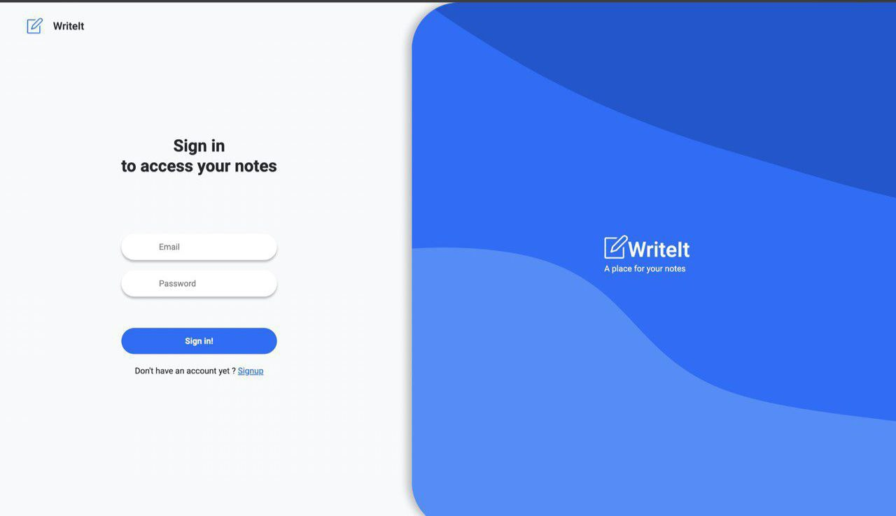
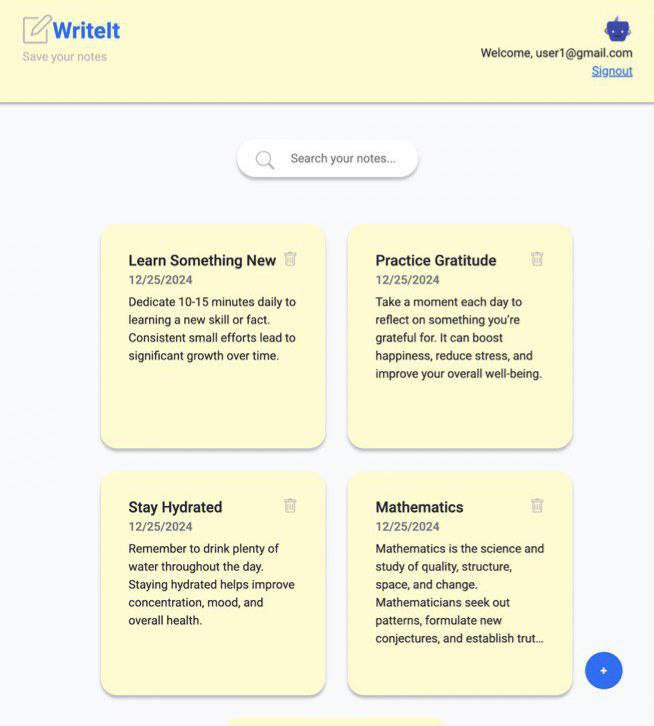

<br />
<div align="center">
  <a href="https://github.com/alikssant/WriteIt">
    
  </a>

<h3 align="center">WriteIt</h3>

<p align="center">
    WriteIt is a simple yet powerful writing application!
    <br />
    <a href="https://github.com/othneildrew/Best-README-Template"><strong>Demo »</strong></a>
    <br />
 </p>
</div>

<!-- ABOUT THE PROJECT -->

## The Project



### Overview:

WriteIt is a simple yet powerful note-taking application where users can create, edit, and delete notes. Each note consists of a title and content, displayed in card format. With features like search functionality and user profiles, WriteIt helps users stay organized and manage their notes effectively.

### Features:

- Create Notes: Add new notes with a title and content.
- Edit Notes: Update existing notes with changes.
- Delete Notes: Remove notes you no longer need.
- Search Functionality: Find notes easily when you have many.
- User Profile: Create an account and manage your notes securely.
- Authentication: Sign up and log in with email and password.
- Responsive Design: The app is built with Bootstrap for responsive layout.

<br />




### Built With

- React: The JavaScript library used for building the user interface.
- Redux: State management for transferring data between components.
- Firebase: Firebase Firestore is used for storing note data.
- React-Router: For handling routing between different pages (e.g., login, notes).
- Bootstrap: For styling and responsiveness.
- React-Bootstrap-Icons: For incorporating Bootstrap icons.
- Axios: Used for making API requests.
- SweetAlert2: For displaying alerts and notifications.
- React-Redux: To manage the state across the application.
- json-server: For running a mock REST API in development.
<br/>
<!-- GETTING STARTED -->


### Installation

Below is an example of how you can instruct your audience on installing and setting up your app.

1. Clone the repo
   ```sh
   git clone https://github.com/alikssant/WriteIt.git
   ```
2. Install NPM packages
   ```sh
   npm install
   ```
3. Set up Firebase:

- Go to Firebase, create a project, and set up Firestore.
- Replace the Firebase configuration in your app with your Firebase credentials.

4. Start the development server:

   ```sh
   npm start
   ```

5. Visit http://localhost:3000 to use the app.
